# 🎨 Simplified Architecture Diagram

**5-Service Production Architecture + External Integrations**

**Last Updated:** February 3, 2026  
**Version:** 2.0 - Added automation targets & detailed frontend

---

## Visual Overview

```mermaid
graph TB
    subgraph Users ["👥 END USERS"]
        U1[Web Browser]
        U2[Mobile App]
    end
    
    subgraph External ["🌐 EXTERNAL DATA SOURCES<br/>(Inbound Telemetry)"]
        E1[Infrastructure<br/>SNMP Devices<br/>Redfish BMC]
        E2[Telegraf Agents<br/>on Servers/VMs<br/>Push metrics]
        E3[Apps with Sentry SDK<br/>Push errors & traces]
        E4[SaaS APIs<br/>Datadog/Splunk<br/>ThousandEyes]
    end
    
    subgraph Automation ["🔧 AUTOMATION TARGETS<br/>(Outbound Actions)"]
        AUTO1[Ansible Tower<br/>Run playbooks]
        AUTO2[Terraform Cloud<br/>Infrastructure changes]
        AUTO3[ServiceNow<br/>Incidents/Changes]
        AUTO4[Jira<br/>Tickets]
    end
    
    subgraph S1 ["📡 SERVICE 1: API<br/>FastAPI - 3-5 pods"]
        API_REST[REST Endpoints<br/>/api/v1/*]
        API_WS[WebSocket<br/>/ws/alerts<br/>/ws/metrics]
        API_WH[Webhooks<br/>/webhooks/telegraf<br/>/webhooks/sentry]
    end
    
    subgraph S2 ["⚙️ SERVICE 2: WORKER<br/>Background - 2-3 pods<br/>✅ STATELESS (Consumer Groups)"]
        W_Prod[Producers<br/>Poll SNMP/Redfish<br/>Poll SaaS APIs]
        W_Cons[Consumer<br/>Parse logs & metrics]
        W_Anom[Anomaly Detector<br/>Statistical + ML + LLM]
        W_Pred[Predictor<br/>Forecasting]
        W_Agg[Aggregator<br/>Cluster issues]
        W_Enr[Enricher<br/>LLM classify & RCA]
        W_Auto[Automation Engine<br/>Execute remediations]
    end
    
    subgraph S3 ["🖥️ SERVICE 3: FRONTEND<br/>Next.js - 3 pods"]
        FE_Dash[📊 Dashboards<br/>Executive KPIs<br/>System Overview<br/>Metrics View]
        FE_Alert[🚨 Alerts<br/>Real-time Alerts<br/>Anomaly Alerts<br/>Predictive Alerts]
        FE_Logs[📝 Logs<br/>Log Search<br/>Clustering View<br/>Timeline]
        FE_Chat[💬 AI Copilot<br/>Chatbot<br/>RCA Assistant]
        FE_Auto[⚙️ Automation<br/>Runbook Status<br/>Approval Queue]
    end
    
    subgraph S4 ["💾 SERVICE 4: REDIS<br/>3-node cluster"]
        Redis[Streams + Cache<br/>Consumer Groups<br/>Pub/Sub]
    end
    
    subgraph S5 ["🗄️ SERVICE 5: POSTGRESQL<br/>Primary + Replica"]
        PG[Data Sources<br/>Alerts + Incidents<br/>Audit Logs<br/>Automation History]
    end
    
    subgraph S6 ["🔮 SERVICE 6: CHROMADB<br/>1-2 instances<br/>✅ REQUIRED"]
        Chroma[Log Prototypes<br/>Vector Embeddings<br/>Semantic Search]
    end
    
    subgraph S7 ["📊 SERVICE 7: INFLUXDB<br/>1-2 instances<br/>✅ REQUIRED"]
        Influx[Historical Metrics<br/>Anomaly Baselines<br/>Prediction Data<br/>Capacity Planning]
    end
    
    subgraph AI ["🤖 AI/ML LAYER"]
        LLM[LLM Service<br/>OpenAI API<br/>or<br/>Ollama<br/>Self-hosted]
    end
    
    %% Users to services
    U1 -->|HTTPS| API_REST
    U1 -->|HTTPS| FE_Dash
    U2 -->|HTTPS| API_REST
    U2 -->|HTTPS| FE_Dash
    
    %% External push sources (Inbound)
    E2 -->|POST metrics| API_WH
    E3 -->|POST errors/traces| API_WH
    
    %% Worker polls external (Inbound)
    E1 -.->|SNMP Poll| W_Prod
    E4 -.->|API Poll| W_Prod
    
    %% API writes to Redis
    API_WH --> Redis
    API_REST --> Redis
    
    %% Worker processing pipeline
    W_Prod --> Redis
    Redis --> W_Cons
    W_Cons --> W_Anom
    W_Anom --> W_Pred
    W_Pred --> W_Agg
    W_Agg --> W_Enr
    W_Enr --> W_Auto
    
    %% Automation targets (Outbound)
    W_Auto -.->|Execute| AUTO1
    W_Auto -.->|Apply| AUTO2
    W_Auto -.->|Create| AUTO3
    W_Auto -.->|Create| AUTO4
    
    %% Redis pub/sub for WebSocket
    Redis -.->|Pub/Sub| API_WS
    
    %% Database access
    W_Cons --> PG
    W_Cons --> Chroma
    W_Cons --> Influx
    W_Anom --> Influx
    W_Pred --> Influx
    W_Enr --> PG
    W_Enr --> Chroma
    W_Auto --> PG
    API_REST --> PG
    API_REST --> Chroma
    API_REST --> Influx
    
    %% LLM Integration
    W_Cons -->|Classify & Parse| LLM
    W_Anom -->|Context Analysis| LLM
    W_Agg -->|Summarize| LLM
    W_Enr -->|Root Cause| LLM
    API_REST -->|Chatbot & HyDE| LLM
    LLM -->|Embeddings| Chroma
    
    %% Anomaly Detection & Prediction
    Influx -.->|Anomaly Baselines| W_Anom
    Influx -.->|Historical Data| W_Pred
    
    %% Frontend connections
    FE_Dash -->|Fetch KPIs| API_REST
    FE_Alert -->|Fetch Alerts| API_REST
    FE_Alert -->|Live Stream| API_WS
    FE_Logs -->|Search| API_REST
    FE_Chat -->|Query| API_REST
    FE_Auto -->|Trigger/Approve| API_REST
    
    %% Styling
    style Users fill:#e7f5ff,stroke:#1971c2,stroke-width:3px
    style External fill:#fff4e6,stroke:#fd7e14,stroke-width:2px
    style Automation fill:#d3f9d8,stroke:#2f9e44,stroke-width:2px
    
    %% Styling
    style Users fill:#e7f5ff,stroke:#1971c2,stroke-width:3px
    style External fill:#fff4e6,stroke:#fd7e14,stroke-width:2px
    style LB fill:#ff6b6b,stroke:#c92a2a,stroke-width:3px,color:#fff
    style S1 fill:#4ecdc4,stroke:#0c8599,stroke-width:2px,color:#fff
    style S2 fill:#9b59b6,stroke:#6c3483,stroke-width:2px,color:#fff
    style S3 fill:#51cf66,stroke:#2f9e44,stroke-width:2px,color:#fff
    style S4 fill:#ffd43b,stroke:#fab005,stroke-width:2px
    style S5 fill:#74c0fc,stroke:#1971c2,stroke-width:2px
    style S6 fill:#ff8c69,stroke:#e03131,stroke-width:2px,color:#fff
    style S7 fill:#20c997,stroke:#099268,stroke-width:2px,color:#fff
    style AI fill:#f06595,stroke:#c2255c,stroke-width:3px,color:#fff
```



---

## 🖥️ Frontend Components Breakdown

### **Service 3: Frontend (Next.js)** - Detailed View

The frontend is organized into 5 main functional areas:

#### **1. 📊 Dashboards**
**Purpose:** Executive and operational visibility

**Views:**
- **Executive Dashboard**
  - MTTR, MTBF, Uptime % (Phase 2)
  - Cost per workload tracking (Phase 2)
  - Trend charts (7-day, 30-day)
  - Top issues summary
  
- **System Overview**
  - Live system health status
  - Service availability map
  - Infrastructure topology
  - Resource utilization (CPU, Memory, Disk)
  
- **Metrics Dashboard**
  - Real-time metric charts (InfluxDB data)
  - Anomaly highlights (red zones)
  - Prediction curves (Phase 1)
  - Custom metric queries

**Data Sources:**
- PostgreSQL: Alert counts, incident history
- InfluxDB: Time-series metrics, anomaly scores
- API: Aggregated KPIs

**Update Method:** 
- Initial: REST API fetch
- Updates: WebSocket push (< 100ms latency)

---

#### **2. 🚨 Alerts**
**Purpose:** Real-time incident management

**Alert Types Displayed:**
- **Real-time Alerts** (from log parsing & clustering)
  - Severity: Critical / High / Medium / Low
  - Status: New / Acknowledged / In Progress / Resolved
  - Age: Time since created
  
- **Anomaly Alerts** (from anomaly detector - Phase 1)
  - Statistical anomalies (Z-score, IQR)
  - ML-detected anomalies (Isolation Forest)
  - LLM-validated anomalies with context
  
- **Predictive Alerts** (from predictor - Phase 1)
  - "Disk will be full in 3 days"
  - "CPU will reach 95% in 4 hours"
  - "Memory exhaustion predicted"

**Features:**
- **Live Updates:** WebSocket streams new alerts instantly
- **Filtering:** By severity, source, time range, status
- **Grouping:** Cluster similar alerts
- **Actions:** Acknowledge, assign, trigger automation, escalate
- **AI Insights:** LLM-generated RCA shown in alert card

**Data Sources:**
- PostgreSQL: Alert metadata, history
- Redis Pub/Sub: Real-time alert stream
- WebSocket: Push notifications

---

#### **3. 📝 Logs**
**Purpose:** Log exploration and analysis

**Views:**
- **Log Search**
  - Full-text search across all logs
  - Semantic search (ChromaDB-powered)
  - Filter by OS, source, time range, severity
  - Highlight similar patterns
  
- **Clustering View**
  - Visual clusters of similar logs
  - Prototype (representative) logs
  - Cluster size and frequency
  - Navigate: Click cluster → See all logs in cluster
  
- **Timeline**
  - Chronological log stream
  - Zoom to time ranges
  - Correlate with metrics (split view)

**Features:**
- **Live Tail:** Stream logs in real-time
- **Export:** Download filtered logs as CSV/JSON
- **Similar Logs:** "Find logs like this" button
- **Context:** Show logs before/after selected log

**Data Sources:**
- PostgreSQL: Parsed logs, cluster assignments
- ChromaDB: Semantic search, prototype matching
- Redis Streams: Real-time log tail

---

#### **4. 💬 AI Copilot**
**Purpose:** Natural language interaction with the platform

**Capabilities:**
- **Chatbot**
  - Natural language queries
  - Examples:
    - "Why is server-03 CPU high?"
    - "Show me all disk errors from last week"
    - "What caused the outage on Feb 1st?"
  
- **RCA Assistant** (Root Cause Analysis)
  - Click alert → Ask AI for explanation
  - Multi-signal correlation (logs + metrics + history)
  - Natural language RCA summary
  - Suggested remediation steps
  
- **Query Assistance**
  - HyDE (Hypothetical Document Embeddings)
  - Semantic search enhancement
  - "Find similar past incidents"

**Features:**
- **Context-Aware:** Knows current dashboard state
- **Citation:** Shows which logs/metrics informed answer
- **Follow-up:** Multi-turn conversations
- **History:** Save chat threads for future reference

**Data Sources:**
- LLM: GPT-4 or Ollama (Llama 2, Mistral)
- ChromaDB: Semantic search for context
- PostgreSQL: Historical incidents
- InfluxDB: Metric correlation

---

#### **5. ⚙️ Automation**
**Purpose:** Automation management and oversight

**Views:**
- **Runbook Status**
  - Active automations running
  - Recent automation history
  - Success/failure rates per runbook
  - Execution logs and output
  
- **Approval Queue** (Phase 2)
  - High-risk changes awaiting approval
  - Risk score and impact analysis
  - Simulation results (if available)
  - Approve/Reject with comments
  
- **Automation Rules**
  - View configured automation rules
  - Enable/disable rules
  - Dry-run mode toggle
  - Cooldown settings

**Features:**
- **Manual Trigger:** Execute runbook on-demand
- **Approval Workflow:** Multi-stage approval for risky changes
- **Audit Trail:** Complete history of automated actions
- **Rollback:** One-click rollback for failed changes (Phase 2)

**Data Sources:**
- PostgreSQL: Automation history, audit logs
- Redis: Real-time automation status
- External: Ansible Tower, Terraform Cloud, ServiceNow APIs

---

## 🔧 Automation Targets (External Systems)

### **Outbound Integrations** - Where Automations Execute

#### **1. Ansible Tower / AWX**
**Purpose:** Execute IT automation playbooks

**Implementation:** `app/streams/automations.py` → `_ansible_tower()`

**Capabilities:**
- Run pre-defined playbooks
- Pass dynamic variables from alerts
- Examples:
  - Disk cleanup when space > 90%
  - Service restart on crash detection
  - Log rotation automation
  - Security patch deployment

**Configuration:**
```yaml
# app/rules/automations.yml
- id: disk_cleanup_ansible
  match:
    failure_type: "disk_space_critical"
    min_confidence: 0.85
  action:
    provider: "ansible_tower"
    params:
      base_url: "https://ansible-tower.company.com"
      job_template_id: "42"
      extra_vars:
        target_host: "{{ alert.result.host }}"
        threshold: "80"
```

**Status:** ✅ Implemented (Phase 1)

---

#### **2. Terraform Cloud**
**Purpose:** Infrastructure as Code changes

**Implementation:** `app/streams/automations.py` → `_terraform_cloud()`

**Capabilities:**
- Trigger workspace runs
- Auto-scaling based on predictions
- Examples:
  - Scale out cluster when CPU predicted to hit 95%
  - Add storage when disk exhaustion predicted
  - Provision new nodes for capacity

**Configuration:**
```yaml
- id: auto_scale_prediction
  match:
    failure_type: "cpu_exhaustion_predicted"
  action:
    provider: "terraform_cloud"
    params:
      workspace_id: "ws-abc123"
      message: "Auto-scaling: {{ alert.result.prediction }}"
```

**Status:** ✅ Implemented (Phase 1)

---

#### **3. ServiceNow**
**Purpose:** ITSM incident and change management

**Implementation:** `app/streams/automations.py` → `_servicenow()`

**Capabilities:**
- Create incidents automatically
- Create change requests
- Update incident status
- Link incidents to CI in CMDB (Phase 2)
- Examples:
  - Auto-create incident for critical alerts
  - Document automated changes
  - Close incident after successful automation

**Configuration:**
```yaml
- id: create_servicenow_incident
  match:
    failure_type: "service_down"
    min_confidence: 0.90
  action:
    provider: "servicenow"
    params:
      base_url: "https://company.service-now.com"
      table: "incident"
      payload:
        short_description: "{{ alert.result.title }}"
        description: "{{ alert.result.summary }}"
        urgency: "1"
        impact: "1"
        category: "Infrastructure"
```

**Status:** ✅ Implemented (Phase 1)

---

#### **4. Jira / Remedy** (Future)
**Purpose:** Issue tracking and project management

**Planned Capabilities:**
- Create tickets for non-urgent issues
- Track remediation tasks
- Link alerts to existing tickets
- Update ticket status based on automation results

**Status:** ⏳ Planned (Phase 2) - API integration similar to ServiceNow

---

## 📊 Data Flow: Inbound vs Outbound

### **Inbound (Data Collection)**
```
External Sources → Worker Producers → Redis → Consumer → Processing
```

| Source Type | Protocol | Frequency | Examples |
|-------------|----------|-----------|----------|
| **Push (Webhooks)** | HTTP POST | Real-time (instant) | Telegraf, Sentry |
| **Pull (Polling)** | SNMP/HTTP GET | 30-60s | SNMP devices, Datadog, Splunk |
| **Streaming** | WebSocket/TCP | Continuous | Future: Kafka, Kinesis |

### **Outbound (Automation Actions)**
```
Worker Automation Engine → External APIs → Infrastructure/ITSM
```

| Target | Protocol | When | Examples |
|--------|----------|------|----------|
| **Ansible Tower** | REST API | On alert trigger | Run playbook, restart service |
| **Terraform Cloud** | REST API | On prediction | Scale infrastructure |
| **ServiceNow** | REST API | Critical alerts | Create incident |
| **Jira** | REST API (Phase 2) | Medium alerts | Create ticket |

---

## 🔄 Traffic Flow Paths

### 1️⃣ **User Opens Dashboard**
```
User Browser → Frontend (Dashboards) → API Service → PostgreSQL + InfluxDB
             (HTTPS)                    (fetch KPIs)   (query data)
```

### 2️⃣ **Telegraf Agent Pushes Metrics**
```
Telegraf Agent → API Webhooks → Redis Streams → Worker Consumer
(on server)    (/webhooks/telegraf)    (XADD)         (XREAD)
                                                          ↓
                                                   Anomaly Detector → InfluxDB
                                                          ↓
                                                   Create Alert if anomalous
```

### 3️⃣ **Sentry SDK Reports Error**
```
Application → API Webhooks → Redis Streams → Worker Consumer
(with SDK)  (/webhooks/sentry)   (XADD)        (XREAD)
                                                   ↓
                                            Worker Enricher → LLM (classify)
                                                   ↓
                                            PostgreSQL (create alert)
                                                   ↓
                                            Redis Pub/Sub → WebSocket
                                                   ↓
                                            Frontend Alerts (instant notification)
```

### 4️⃣ **Worker Polls SNMP Device**
```
Worker Producer ← SNMP Device (poll every 60s)
     ↓
Redis Streams → Worker Consumer → Anomaly Detector → InfluxDB
                                         ↓
                                   If anomaly → Create Alert
```

### 5️⃣ **Real-time Alert to User (WebSocket)**
```
Worker Enricher → Redis Pub/Sub → API WebSocket → Frontend Alerts
                 (PUBLISH alert)   (push)          (< 100ms notification)
                                                    ↓
                                            Toast + Sound + Badge Update
```

### 6️⃣ **Anomaly Detected → Automation Triggered**
```
Anomaly Detector → Create Alert → Redis Alerts Stream → Automation Engine
                                                               ↓
                                                    Check automation rules
                                                               ↓
                                              Match: disk_space_critical
                                                               ↓
                                              Trigger: Ansible Tower
                                                               ↓
                                        Execute: disk_cleanup.yml playbook
                                                               ↓
                                         Verify: Check disk % after 2 min
                                                               ↓
                                    Success: Close alert | Failure: Escalate
```

### 7️⃣ **Prediction Triggers Proactive Automation**
```
Predictor → "Disk will be full in 3 days" → Create Predictive Alert
                                                     ↓
                                          Redis Alerts Stream
                                                     ↓
                                          Automation Engine
                                                     ↓
                                          Trigger: Terraform Cloud
                                                     ↓
                                      Execute: Add 500GB storage volume
                                                     ↓
                                      Create: ServiceNow Change Request
                                                     ↓
                          Log: "Proactively prevented disk exhaustion"
```

### 8️⃣ **User Uses AI Copilot**
```
Frontend Chatbot → API REST → LLM Service (GPT-4 / Ollama)
                                    ↓
                        Query: ChromaDB (semantic search)
                                    ↓
                        Query: PostgreSQL (incidents)
                                    ↓
                        Query: InfluxDB (metrics)
                                    ↓
                        Generate: Natural language answer
                                    ↓
                        Return: "Here's why CPU spiked..."
```

---

## Deployment Layers

```
┌─────────────────────────────────────────────────────────────┐
│  LAYER 1: APPLICATION SERVICES (Containers)                 │
│  ┌─────────────┐  ┌─────────────┐  ┌─────────────┐        │
│  │  API (3-5)  │  │ Worker (2-3)│  │Frontend (3) │        │
│  │  FastAPI    │  │  Background │  │  Next.js    │        │
│  │  Stateless  │  │  Stateless  │  │  Stateless  │        │
│  └─────────────┘  └─────────────┘  └─────────────┘        │
└─────────────────────────────────────────────────────────────┘
                              ↓
┌─────────────────────────────────────────────────────────────┐
│  LAYER 2: DATA SERVICES (Managed or Self-hosted)           │
│  ┌──────────────────────────┐  ┌──────────────────────────┐│
│  │  Redis Cluster (3 nodes) │  │ PostgreSQL (Primary+Rep) ││
│  │  Event Streaming         │  │  Relational Data         ││
│  │  Managed Service ✓       │  │  Managed Service ✓       ││
│  └──────────────────────────┘  └──────────────────────────┘│
└─────────────────────────────────────────────────────────────┘
```

---

## Component Responsibilities

| Component | Responsibility | Scales By | State | Why Stateless/Stateful |
|-----------|---------------|-----------|-------|------------------------|
| **API Service** | HTTP endpoints, WebSocket | Traffic (RPS) | ✅ Stateless | No local state, sessions in Redis |
| **Worker Service** | Background processing | Workload | ✅ Stateless | Consumer Groups track offsets in Redis |
| **Frontend** | UI rendering | Users | ✅ Stateless | Static assets + SSR |
| **Redis** | Event bus, cache | Memory | 🔴 Stateful | Stores streams and offsets |
| **PostgreSQL** | Persistent data | Storage | 🔴 Stateful | Stores structured data |
| **LLM Service** | Classification, summarization, chatbot | API calls | ✅ Stateless | Cloud API or stateless model server |
| **ChromaDB** | Vector embeddings, prototypes | Embeddings | 🔴 Stateful | Stores vector index |
| **InfluxDB** | Time-series metrics, anomaly baselines | Time-series data | 🔴 Stateful | Stores historical metrics |

---

## Simplified Data Flow

```
1. INGESTION (Multiple Entry Points)
   
   A) Push Model:
      Telegraf Agents → API Webhooks → Redis
      Sentry SDKs → API Webhooks → Redis
      
   B) Pull Model (Worker initiates):
      Worker Producers → SNMP/Redfish Devices
      Worker Producers → SaaS APIs (Datadog/Splunk)
      Worker Producers → Redis

   C) User Interface:
      User Browser/Mobile → Frontend

2. PROCESSING (AI-Enhanced)
   Redis → Worker Consumer (Parse with LLM) → Redis
        → Worker Aggregator (Summarize with LLM) → Redis
        → Worker Enricher (RCA with LLM) → Redis
                                    ↓
                               PostgreSQL (alerts/incidents)
                               ChromaDB (embeddings from LLM)

3. STORAGE
   Worker → PostgreSQL (Alerts, Config, Incidents, Automation History)
   Worker → ChromaDB (Vector embeddings, prototypes) ✅ REQUIRED
   Worker → InfluxDB (Historical metrics, anomaly baselines) ✅ REQUIRED
   LLM → Generate embeddings for ChromaDB
   InfluxDB → Provides baselines for anomaly detection
   InfluxDB → Provides data for prediction engine

4. AUTOMATION (Outbound)
   Worker Automation Engine → Ansible Tower (run playbooks)
                           → Terraform Cloud (scale infrastructure)
                           → ServiceNow (create incidents/changes)
                           → Jira (create tickets - Phase 2)

5. DISTRIBUTION
   Redis Pub/Sub → API WebSocket → Frontend (Alerts, Metrics, Logs)

6. QUERY (AI-Powered)
   Frontend → API → LLM (Chatbot, HyDE queries, RCA)
          → API → PostgreSQL → Frontend (structured data)
          → API → ChromaDB (semantic search) → Frontend (similar logs)
          → API → InfluxDB (metrics, anomalies) → Frontend (charts)
```

---

## 🤖 LLM Integration Points

### **LLM Service Options:**
1. **OpenAI API** (Cloud) - GPT-4, GPT-3.5-turbo, text-embedding-ada-002
2. **Ollama** (Self-hosted) - Llama 2, Mistral, CodeLlama, Nomic-embed

### **LLM Usage in Worker Pipeline:**

| Stage | LLM Task | Purpose |
|-------|----------|---------|
| **Consumer** | Log classification & parsing | Extract structured data from raw logs |
| **Aggregator** | Issue summarization | Create human-readable summaries of clusters |
| **Enricher** | Root cause analysis | Generate hypotheses about failure causes |
| **Enricher** | Embeddings generation | Convert logs to vectors for ChromaDB |

### **LLM Usage in API Layer:**

| Feature | LLM Task | Purpose |
|---------|----------|---------|
| **Chatbot** | Conversational Q&A | Answer operator questions about alerts |
| **HyDE** | Hypothetical Document Embeddings | Improve semantic search accuracy |
| **Alert Summarization** | Natural language generation | Create executive-friendly summaries |

### **Configuration:**
```env
# OpenAI (Cloud)
LLM_PROVIDER=openai
OPENAI_API_KEY=sk-...
OPENAI_MODEL=gpt-4

# Ollama (Self-hosted)
LLM_PROVIDER=ollama
OLLAMA_BASE_URL=http://ollama:11434
OLLAMA_MODEL=llama2
OLLAMA_EMBED_MODEL=nomic-embed-text
```

---

## Key Data Source Types

### 📊 **Telegraf (Infrastructure Metrics Agent)**
- **What:** Lightweight telemetry collector running on servers/VMs/containers
- **Collects:** CPU, memory, disk, network, SNMP, database stats, sensor data
- **Model:** Agent **pushes** metrics to `/webhooks/telegraf`
- **Purpose:** Infrastructure health & capacity monitoring
- **Users:** Ops/SRE teams

### 🐛 **Sentry (Application Error Monitoring)**
- **What:** SDK embedded in application code
- **Collects:** Exceptions, stack traces, app crashes, slow transactions, performance traces
- **Model:** SDK **pushes** errors/traces to `/webhooks/sentry`
- **Purpose:** Application debugging & reliability
- **Users:** Developers

### 🔌 **SNMP/Redfish (Device Polling)**
- **What:** Network/hardware device protocols
- **Collects:** Device status, power, temperature, network stats
- **Model:** Worker **polls** devices (pull model)
- **Purpose:** Hardware & network monitoring
- **Users:** Network/Facilities teams

### ☁️ **SaaS APIs (External Platforms)**
- **What:** Third-party observability platforms
- **Collects:** Logs, metrics, alerts from Datadog, Splunk, ThousandEyes
- **Model:** Worker **polls** APIs (pull model)
- **Purpose:** Aggregate multi-platform data
- **Users:** All teams

---

## Key Simplifications

✅ **Consolidated from 12 → 5 services**  
✅ **API handles all HTTP traffic** (REST + WebSocket + Webhooks)  
✅ **Worker handles all background** (Producers + Consumer + Enrichment)  
✅ **Managed data stores** (Redis + PostgreSQL as services)  
✅ **Clear separation** (Stateless vs Stateful)

---

## 🎯 Summary

**7 Core Services:**
1. API Service (3-5 instances) - ✅ Stateless
2. Worker Service (2-3 instances) - ✅ Stateless (with consumer groups)
3. Frontend Service (3 instances) - ✅ Stateless
   - 📊 Dashboards (Executive, System, Metrics)
   - 🚨 Alerts (Real-time, Anomaly, Predictive)
   - 📝 Logs (Search, Clustering, Timeline)
   - 💬 AI Copilot (Chatbot, RCA Assistant)
   - ⚙️ Automation (Runbooks, Approval Queue)
4. Redis Cluster (3 nodes) - 🔴 Stateful
5. PostgreSQL (2 instances) - 🔴 Stateful
6. ChromaDB (1-2 instances) - 🔴 Stateful ✅ REQUIRED
7. InfluxDB (1-2 instances) - 🔴 Stateful ✅ REQUIRED

**External Integrations:**

**Inbound (Data Sources):**
- Telegraf agents (push metrics)
- Sentry SDK (push errors)
- SNMP devices (polled)
- Datadog/Splunk (polled)
- Redfish BMC (polled)

**Outbound (Automation Targets):**
- ✅ Ansible Tower (playbook execution)
- ✅ Terraform Cloud (infrastructure changes)
- ✅ ServiceNow (incident/change management)
- ⏳ Jira (Phase 2 - ticket tracking)

**AI/ML Layer (Choose One):**
- **OpenAI API** (Cloud, managed, $$$)
- **Ollama** (Self-hosted, 1+ instances, GPU recommended)

**Total: ~15-21 containers for production** (+ optional Ollama if self-hosted)

**Complexity: MEDIUM** (manageable by 2-3 engineers)

**Data Source Models:**
- **Push (Real-time):** Telegraf agents, Sentry SDKs → API Webhooks
- **Pull (Scheduled):** Worker Producers → SNMP/Redfish/SaaS APIs
- **UI:** Users → Frontend → API → WebSockets (live updates)

**AI/ML Features:**
- ✅ Log classification & parsing
- ✅ Issue summarization & clustering
- ✅ Root cause analysis (RCA)
- ✅ Conversational chatbot
- ✅ Semantic search (HyDE)
- ✅ Vector embeddings
- ⚠️ **Anomaly detection** (Phase 1 - via InfluxDB + Statistical + ML + LLM)
- ⚠️ **Predictive alerts & forecasting** (Phase 1 - via Prophet/LSTM)
- ✅ **Automated remediation** (Ansible/Terraform/ServiceNow integrated)

**Why Worker is Stateless:**
Redis Streams Consumer Groups store processing offsets in Redis itself, not on worker instances. This allows workers to be scaled horizontally without coordination or state management.

**How Worker Runs Tasks in Parallel:**
The worker uses Python's `asyncio` to run **all tasks concurrently** (in parallel), not sequentially:
- ✅ Consumer, Aggregator, Enricher, Producers, Automation all run simultaneously
- ✅ If one task waits for I/O (InfluxDB, PostgreSQL, LLM), others continue running
- ✅ No blocking, efficient for I/O-bound workloads

---

## 📚 Related Documentation

- **Complete Technical Spec:** `PRODUCTION_ARCHITECTURE.md`
- **Phase 1 Missing Components:** `MISSING_COMPONENTS.md`
- **Phase 2 Advanced Features:** `MISSING_COMPONENTS_PHASE_2.md`
- **Documentation Guide:** `README_ARCHITECTURE.md`

**Last Updated:** February 3, 2026  
**Version:** 2.0 - Added automation targets & detailed frontend components
